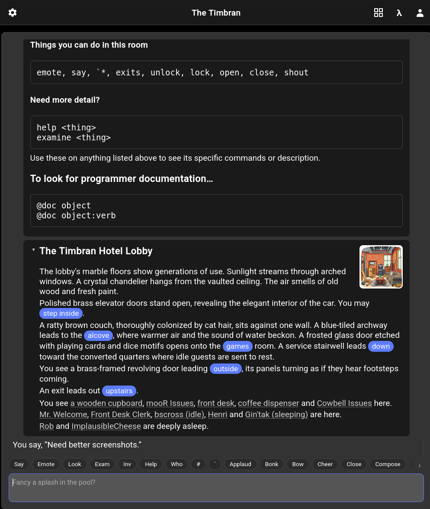
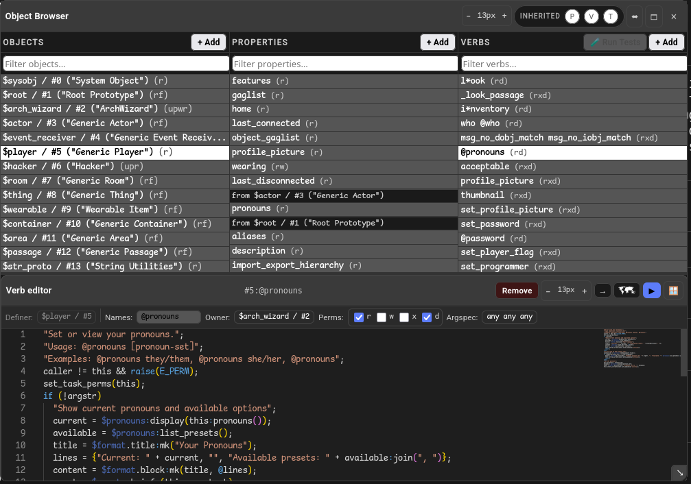
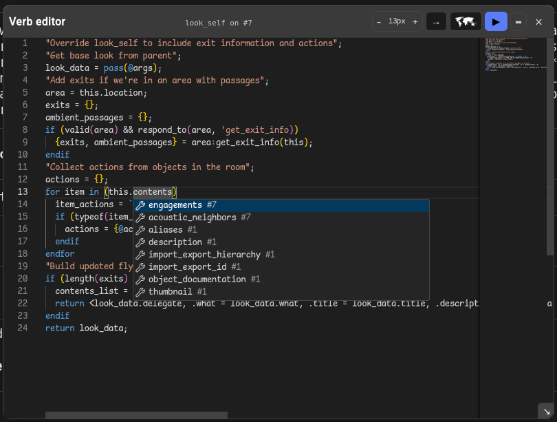

# Meadow

A rich and beautiful web & mobile client for interacting with mooR worlds.

<p align="center"></p>

## Overview

Meadow provides a modern interface for [mooR](https://codeberg.org/timbran/moor) servers,
communicating with the backend through WebSocket connections and RESTful API calls handled by the
`moor-web-host` binary. It is the default client for the
[Cowbell](https://codeberg.org/timbran/cowbell) core.

Meadow can run as a web application served alongside a mooR backend, or as a standalone desktop
application built with [Tauri](https://v2.tauri.app/) that connects to any remote mooR server.

## Features

### Rich Presentation

- **Multimedia Content:** Renders a rich HTML subset and **Djot** (a modern, faster Markdown-like
  format) for complex styling, tables, and integrated media.
- **Terminal Heritage:** Full support for **ANSI colors** and styles inline in content.
- **Image presentation:** Inline image thumbnails in object descriptions.
- **Interactive Narrative:** Inline links for executing commands directly from the text and
  automatic
- **URL previews**. Slack/Discord-style embeds for links to external sites, with thumbnails.
- **Infinite History:** Seamless "infinite" backscroll through mooR's **encrypted and secure event
  log**, allowing you to retrieve your entire character history.

... and more coming.

### User Experience

- **Identity Management:** Integrated profile picture uploader and built-in player description
  editor.
- **Personalization:** Multiple themes (dark, light, and more) to suit your aesthetic.
- **Dynamic Command Entry:** A "verb palette" that provides real-time suggestions and
  autocompletions as you type, alongside a full, searchable command history.

### Developer Tools (MOO IDE)

Meadow is not just a user facing client; it's a development environment for MOO programmers, for
authoring persistent worlds and building objects in the MOO using modern development tools:

- **Object Browser:** A Smalltalk-style browser for navigating the list of objects, their verbs, and
  their properties.
  - Can create new objects and edit existing ones, add new verbs and properties, and edit them using
    the GUI without using the MOO command line.

<p align="center"></p>

- **Monaco-powered Editor:** The same core editor that powers **VS Code**, featuring:
  - Syntax highlighting for MOO code.
  - Dynamic autocompletion based on the live world state.
  - Integrated compiler feedback and error reporting.
  - Verb editor highlights compile errors.

<p align="center"></p>

## Project Structure

Meadow is a React application built with Vite and TypeScript, with an optional
[Tauri 2.0](https://v2.tauri.app/) shell for desktop packaging. It relies on the `@moor/schema` NPM
package for FlatBuffer bindings, which are shared with the mooR backend.

```
├── src/                  # React frontend (TypeScript)
├── src-tauri/            # Tauri desktop shell (Rust)
│   ├── Cargo.toml
│   ├── tauri.conf.json
│   ├── src/
│   ├── capabilities/
│   └── icons/
├── public/               # Static assets (WASM, etc.)
├── deploy/               # Debian packaging scripts
└── vite.config.ts
```

## Development

Meadow is designed to be developed alongside the `moor` backend.

```bash
# Install dependencies
npm install

# Start development server (defaults to http://localhost:3000)
npm run dev

# Start the full stack (requires 'moor' to be in a sibling directory)
npm run full:dev

# Build for production
npm run build

# Type checking
npm run typecheck

# Linting
npm run lint
```

### Environment Variables

- `MOOR_PATH`: Path to the mooR backend repository (defaults to `../moor`).
- `MOOR_API_URL`: URL of the `moor-web-host` API (defaults to `http://localhost:8080`).
- `MOOR_WS_URL`: URL of the WebSocket endpoint (defaults to `ws://localhost:8080`).

## FlatBuffer Schemas

This project uses `@moor/schema` for communication. If you modify schemas in the `moor` repository,
they will be automatically published to the Codeberg registry. To update Meadow to the latest
schema:

```bash
npm install @moor/schema@latest
```

## Desktop App (Tauri)

Meadow can be built as a native desktop application using Tauri. This wraps the web frontend in a
lightweight WebKit-based window and allows connecting to any remote mooR server.

### Prerequisites

In addition to Node.js, building the desktop app requires:

- **Rust** (1.70+): Install via [rustup](https://rustup.rs/)
- **Linux system libraries:**
  ```bash
  sudo apt-get install -y \
    libglib2.0-dev \
    libwebkit2gtk-4.1-dev \
    libjavascriptcoregtk-4.1-dev \
    libsoup-3.0-dev \
    libgtk-3-dev
  ```

### Building

```bash
# Development mode (opens app with hot-reload)
npm run tauri:dev

# Production build
npm run tauri:build
```

The release binary is output to `src-tauri/target/release/meadow`.

### Usage

```bash
# Connect to a remote mooR server
./meadow --server https://moo.example.com

# Short flag form
./meadow -s https://moo.example.com
```

Without `--server`, the app attempts to connect to the same origin (useful during development with
the Vite proxy).

## Web Deployment

Meadow can also be deployed as a web application via Docker:

```bash
docker build -t meadow .
docker run -p 80:80 meadow
```

For more details on the overall mooR system, see the [mooR Book](https://timbran.org/book/html/).
