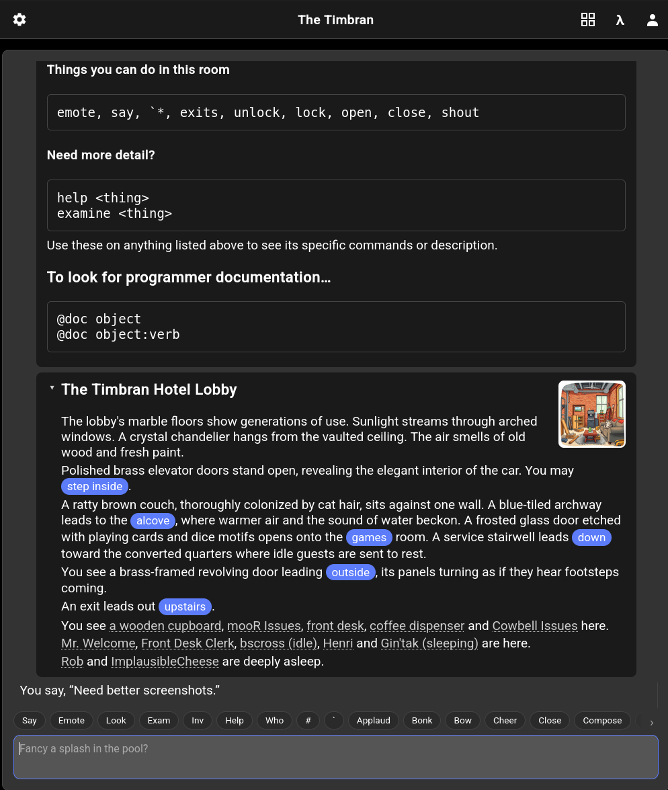
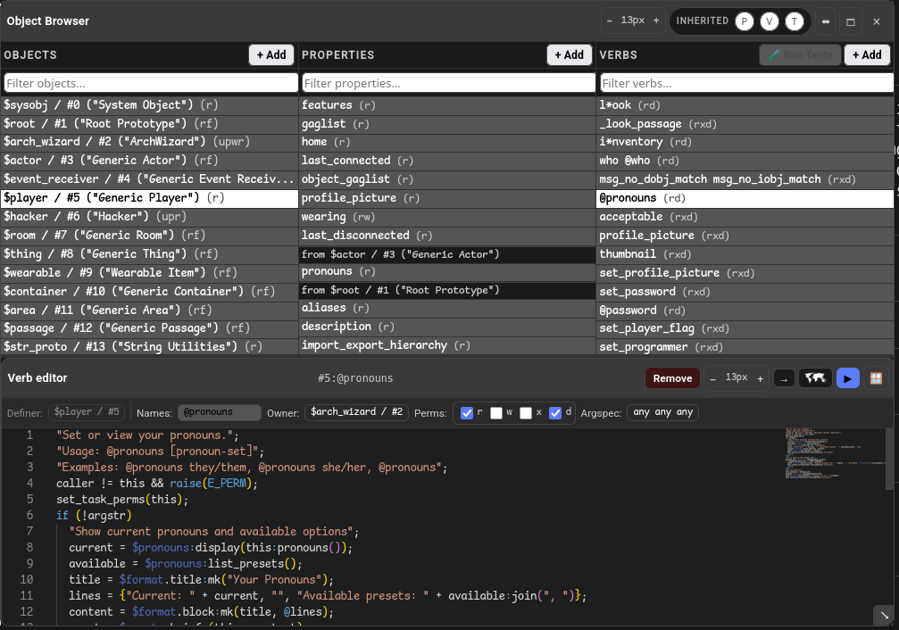
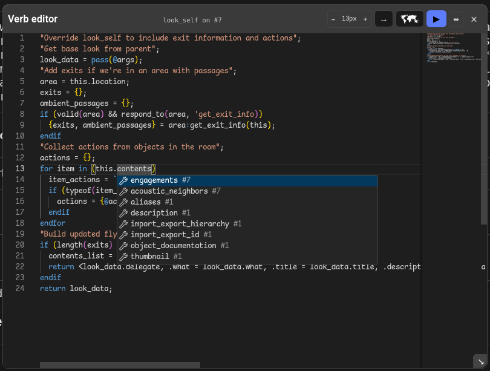

# Meadow

A rich and beautiful web & mobile client for interacting with mooR worlds.

<p align="center"></p>

## Overview

Meadow provides a modern interface for [mooR](https://github.com/timbran-project/moor) servers,
communicating with the backend through WebSocket connections and RESTful API calls handled by the
`moor-web-host` binary. It is the default client for the
[Cowbell](https://github.com/timbran-project/moor/tree/main/cores/cowbell) core.

Meadow can run as a web application served alongside a mooR backend, or as a standalone desktop
application built with [Tauri](https://v2.tauri.app/) that connects to any remote mooR server.

## Version Lines

Meadow and `moor` currently have two active version lines:

- `v1.0-release`: the stable 1.0 line
- `main`: the post-1.0 development line

Use matching branches across the stack. A Meadow checkout on `v1.0-release` should be used with the
`v1.0-release` line of `moor` and the corresponding `1.0.0-rc1-dev...` published packages. A Meadow
checkout on `main` should be used with `moor` `main` and the corresponding `1.1.0-dev...` published
packages.

`main` in the `moor` repository tracks post-1.0 development. If you want the stable 1.0 setup, use
the `v1.0-release` line rather than `main`.

## Features

### Rich Presentation

- **Multimedia Content:** Renders a rich HTML subset and **Djot** (a modern, faster Markdown-like
  format) for complex styling, tables, and integrated media.
- **Terminal Heritage:** Full support for **ANSI colors** and styles inline in content.
- **Image presentation:** Inline image thumbnails in object descriptions.
- **Interactive Narrative:** Inline links for executing commands directly from the text and
  automatic
- **URL previews**. Slack/Discord-style embeds for links to external sites, with thumbnails.
- **Infinite History:** Seamless "infinite" backscroll through mooR's **encrypted and secure event
  log**, allowing you to retrieve your entire character history.

... and more coming.

### User Experience

- **Identity Management:** Integrated profile picture uploader and built-in player description
  editor.
- **Personalization:** Multiple themes (dark, light, and more) to suit your aesthetic.
- **Dynamic Command Entry:** A "verb palette" that provides real-time suggestions and
  autocompletions as you type, alongside a full, searchable command history.

### Developer Tools (MOO IDE)

Meadow is not just a user facing client; it's a development environment for MOO programmers, for
authoring persistent worlds and building objects in the MOO using modern development tools:

- **Object Browser:** A Smalltalk-style browser for navigating the list of objects, their verbs, and
  their properties.
  - Can create new objects and edit existing ones, add new verbs and properties, and edit them using
    the GUI without using the MOO command line.

<p align="center"></p>

- **Monaco-powered Editor:** The same core editor that powers **VS Code**, featuring:
  - Syntax highlighting for MOO code.
  - Dynamic autocompletion based on the live world state.
  - Integrated compiler feedback and error reporting.
  - Verb editor highlights compile errors.

<p align="center"></p>

## Project Structure

Meadow is a React application built with Vite and TypeScript, with an optional
[Tauri 2.0](https://v2.tauri.app/) shell for desktop packaging. It relies on the local
`@moor/schema` npm workspace for FlatBuffer bindings shared with the mooR backend.

```
├── src/                  # React frontend (TypeScript)
├── src-tauri/            # Tauri desktop shell (Rust)
│   ├── Cargo.toml
│   ├── tauri.conf.json
│   ├── src/
│   ├── capabilities/
│   └── icons/
├── public/               # Static assets (WASM, etc.)
├── deploy/               # Debian packaging scripts
└── vite.config.ts
```

## Development

Run these commands from the mooR repository root so npm resolves the local schema and SDK
workspaces:

```bash
# Install dependencies
npm ci

# Start development server (defaults to http://localhost:3000)
npm run meadow:dev

# Start the full stack with the single-process moor server
npm run full:dev

# Build for production
npm run meadow:build

# Type checking
npm run typecheck --workspace meadow

# Linting
npm run lint --workspace meadow
```

### Type checking

`npm run typecheck --workspace meadow` checks four TypeScript projects in order:

| Command            | Configuration          | Checked code and environment                                                                                              |
| ------------------ | ---------------------- | ------------------------------------------------------------------------------------------------------------------------- |
| `typecheck:app`    | `tsconfig.json`        | Browser application, DOM and Vite client types; excludes tests and worker entry points.                                   |
| `typecheck:worker` | `tsconfig.worker.json` | Export worker and its helpers, with WebWorker types and no browser window, Node, or test globals.                         |
| `typecheck:test`   | `tsconfig.test.json`   | All `src/**/*.test.{ts,tsx}` and `src/**/*.spec.{ts,tsx}` files, plus `vitest.setup.ts`; jsdom, Node, and Vitest globals. |
| `typecheck:node`   | `tsconfig.node.json`   | `vite.config.ts` and `vitest.config.ts`, with Node types and no Vitest globals.                                           |

The application and test projects also check their imported source files. Shared worker helpers can
be checked from both the browser and worker projects. Each environment selects its own ambient
types; Vitest's imported jsdom configuration types additionally bring DOM declarations into the Node
configuration project. Node type definitions target the Node 20 runtime used in CI.

`npm run build --workspace meadow` checks the application and worker projects before bundling. The
existing web CI job runs `npm run web:typecheck`, which includes all four Meadow checks along with
the SDK and MCP client checks. Test execution remains `npm test --workspace meadow`.

### Environment Variables

- `MOOR_PATH`: Path to the mooR repository root (defaults to `../..`).
- `MOOR_API_URL`: URL of the mooR web API (defaults to `http://localhost:8080`).
- `MOOR_WS_URL`: URL of the WebSocket endpoint (defaults to `ws://localhost:8080`).

## FlatBuffer Schemas

Meadow uses the private `@moor/schema` and `@moor/web-sdk` workspaces from the same monorepo
checkout. The 2.0 development packages are not published to an npm registry.

## Running Stable 1.0

To run the stable 1.0 line, use:

- `moor` on `v1.0-release`
- Meadow on `v1.0-release`
- The Meadow assets bundled with the 1.0 release image or release packages

The `main` branch is the 2.0 development line and builds its client dependencies locally.

## Editor loading and bundle budgets

The verb, text, and property editors, object browser, and evaluation panel load when first opened.
Each surface has a loading message and a local retry/close control if loading fails; the transcript
stays mounted. Covering a docked editor preserves its local edits.

Monaco uses the bundled npm package through the
[React loader configuration](https://github.com/suren-atoyan/monaco-react#use-monaco-editor-as-an-npm-package).
MOO and plaintext use the editor worker, Djot uses Markdown highlighting, and HTML retains its
language services and worker. TypeScript, JavaScript, JSON, and CSS language services are not
bundled.

Production source maps are disabled by default. To include them explicitly:

```bash
MEADOW_SOURCEMAPS=true npm run build --workspace meadow
```

After building, run the budget report from the repository root:

```bash
npm run bundle:check --workspace meadow
npm run test:bundle --workspace meadow
```

The check writes `dist/bundle-report.json` and runs in web CI. `bundle-budget.json` caps startup
JavaScript at 1,800,000 bytes / 320,000 bytes gzip, all JavaScript at 10,000,000 bytes / 2,000,000
bytes gzip, and aggregate workers at 1,350,000 bytes. Startup includes every transitive static
import from the Vite manifest, counted once; moving code into a statically imported chunk does not
reduce that measurement. Totals include deferred chunks, workers, and public JavaScript. Gzip totals
sum individually compressed files. Budget changes should accompany measurements and an explanation.

Measured on 2026-09-30 with `npm run build --workspace meadow` (decimal kB):

| Asset                                               |            Before #503 |  After #503 |
| --------------------------------------------------- | ---------------------: | ----------: |
| Main/startup JavaScript                             |            7,733.59 kB | 1,554.80 kB |
| Main/startup JavaScript, gzip                       |            1,436.57 kB |   264.85 kB |
| All JavaScript, including workers and public assets |           17,597.99 kB | 8,652.41 kB |
| TypeScript worker                                   |            7,010.05 kB | Not emitted |
| HTML worker                                         |              693.10 kB |   693.05 kB |
| Editor worker                                       | Not emitted separately |   251.66 kB |

The deferred Monaco editor chunk remains 5,699.71 kB (1,101.32 kB gzip). Vite still reports large
chunks; the explicit budgets distinguish startup cost from editor loading cost.

## Transcript window

The transcript displays at most 200 complete message groups at a time. Scrolling near either end
moves the window by 100 groups, keeping an overlapping group at its previous viewport offset.
**Older messages** and **Newer messages** move to the start of the adjacent window; **Jump to Now**
returns to the live tail. Older history is fetched only after reaching the beginning of the locally
loaded groups. The scrollbar describes the displayed window, not the whole history.

Selecting transcript text or focusing one of its controls holds the window and pauses automatic
scrolling. The navigation buttons still work deliberately. After releasing selection or focus,
scrolling to the live end or choosing **Jump to Now** resumes following output. Browser Find and
Select All cover the mounted window; use the JSON export for full history.

Historical rows are readable but are not live-announced when the window moves. A separate polite
region announces new output, preferring supplied TTS text. A burst is limited to the newest 200
announcements, with a count of additional messages. Announcements contain text, without duplicate
interactive links or images.

Loaded message data remains in memory so local navigation does not discard output. Rendering is
bounded by group count, not bytes: a single large inset or no-newline group stays intact and can
contain more than 200 messages. The transcript indexes message IDs, group positions, room looks, and
live messages separately. Appending and ordinary rewrites do not rebuild historical groups; initial
history replacement and rewrites that change group boundaries can rebuild the index.

Tested on 2026-09-30 with 10,000 historical plain-text messages and one live append, using Vitest
and jsdom. Representative isolated runs on the same development machine:

| Measurement              | Before #502 | After #502 |
| ------------------------ | ----------: | ---------: |
| Initial index and render |     1463 ms |      99 ms |
| Live append              |      241 ms |      22 ms |
| Mounted message nodes    |      10,001 |        200 |

The regression asserts the mounted-node limit and retained message count, without a machine-specific
timing threshold. Timings exclude a real browser's layout and paint and are not browser benchmarks.
Additional tests cover overlapping scroll anchors, resize/prepend stability, selection/focus holds,
complete groups, keyboard-accessible controls, room-look visibility, and live announcements. Native
browser and screen-reader smoke testing remains outstanding.

```bash
npm test --workspace meadow -- src/components/OutputWindow.performance.test.tsx
npm test --workspace meadow -- src/hooks/useTranscriptWindow.test.tsx src/lib/transcript.test.ts src/components/OutputWindow.test.tsx
```

## History exports

On browsers with a Save File picker, **Download All History (JSON)** first asks for a destination,
then writes the export to that file as it is processed. The file is committed only after the export
finishes and the
[file stream closes](https://developer.mozilla.org/en-US/docs/Web/API/FileSystemFileHandle/createWritable).
Cancelling, closing settings, or changing the active credentials stops the export and aborts the
pending write. The browser may leave an empty file if a new destination was selected.

Other browsers prepare a download in memory with a **64 MiB limit on the encoded JSON**, including
metadata. Exceeding the limit stops the export with an error; no partial download is offered. Larger
exports require a browser with file streaming support.

The worker fetches up to 250 events per page, decrypts and serializes one event at a time, and waits
for each 64 KiB output chunk to be accepted before continuing. Responses larger than 16 MiB are
rejected to bound page buffering, even in streaming mode. Memory use depends on a page and the
current event, plus at most 64 MiB of buffered output for the download fallback. Constructing the
final Blob may temporarily duplicate that output buffer.

Exports contain compact JSON with the existing `events` array and metadata fields. Metadata follows
the array so event counts and the timestamp range can be calculated while writing. Events that
cannot be decoded are skipped and reported in `skipped_event_count` and the completion message.

## Link previews

Preview destinations and images must use absolute HTTP(S) URLs. Opening a preview uses the same
external-link confirmation and remembered navigation domains as narrative links. The card shows the
destination hostname even when the server supplies a site name.

Preview images load only after selecting **Load image from [host]**, including images from domains
trusted for navigation. This permission applies to that card and image until it is replaced or
unmounted; it is not stored. Loading contacts the image host (and any redirects) and may send
cookies subject to browser policy. The image request omits the referrer. Loading an image neither
opens the preview link nor trusts its domain for navigation.

## Browser credential storage

Meadow remembers authentication/history tokens in localStorage and copies the active identity into
sessionStorage for each tab. Reconnect credentials are held in sessionStorage. The age private
identity is stored in localStorage under the history owner's player OID so history can be decrypted
after a reload without entering the encryption password again.

This persistence is a usability tradeoff: JavaScript executing in Meadow's origin can read those
tokens and private identities, fetch history, and decrypt it. Client-side history encryption does
not protect against a compromised client bundle, same-origin script injection, or access to the
browser profile. Serve the client from an origin you trust and use a separate browser profile on
shared devices.

The pending OAuth encryption password is held only in memory, separately from the persisted auth
session. It is consumed once for setup and discarded on logout, identity replacement, cancellation,
or when automatic setup is unnecessary. Reloading before setup completes requires entering the
password again. JavaScript strings cannot be reliably zeroized; dropping references limits retention
but does not provide secure memory erasure.

Logout clears session credentials but retains the cached history identity for later use. Use Remove
Password in encryption settings, or clear site data, to remove that local identity. Encryption
diagnostics must not include passwords, private keys, fragments, or raw cryptographic exception
payloads.

The current Tauri shell uses the same frontend credential storage and makes no stronger credential
protection claim than the web build. OS credential-store integration remains deferred with the other
Tauri work.

## Desktop App (Tauri)

Meadow can be built as a native desktop application using Tauri. This wraps the web frontend in a
lightweight WebKit-based window and allows connecting to any remote mooR server.

### Prerequisites

In addition to Node.js, building the desktop app requires:

- **Rust** (1.70+): Install via [rustup](https://rustup.rs/)
- **Linux system libraries:**
  ```bash
  sudo apt-get install -y \
    libglib2.0-dev \
    libwebkit2gtk-4.1-dev \
    libjavascriptcoregtk-4.1-dev \
    libsoup-3.0-dev \
    libgtk-3-dev
  ```

### Building

```bash
# Development mode (opens app with hot-reload)
npm run tauri:dev

# Production build
npm run tauri:build
```

The release binary is output to `src-tauri/target/release/meadow`.

### Usage

```bash
# Connect to a remote mooR server
./meadow --server https://moo.example.com

# Short flag form
./meadow -s https://moo.example.com
```

Without `--server`, the app attempts to connect to the same origin (useful during development with
the Vite proxy).

## Web Deployment

Meadow can also be deployed as a web application via Docker:

```bash
docker build -t meadow .
docker run -p 80:80 meadow
```

For more details on the overall mooR system, see the [mooR Book](https://timbran.org/book/html/).
