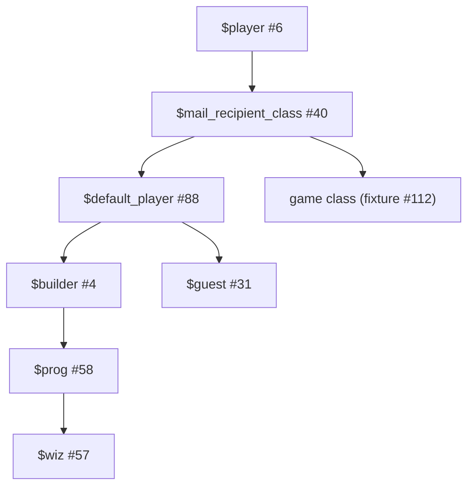

# Player classes and command placement

The role classes retain LambdaCore's hierarchy. Command packs stay separate from those classes. The
classes supply the per-player state and methods used by the packs.

`$player_class` initially selects `$default_player`. Shipped class objects use numbered IDs.
Accounts and other user-created objects use UUID IDs.

## Defaults and role support

| Class                   | Default features                 | Supporting state and methods                                                    |
| ----------------------- | -------------------------------- | ------------------------------------------------------------------------------- |
| `$player`               | None                             | Session, output, matching, identity, inventory, private paging, gagging         |
| `$mail_recipient_class` | Inherited                        | Mail storage, subscriptions, mail/news commands, refusals and spurns            |
| `$default_player`       | Pasting, Stage-Talk, Utility     | Non-VR conveniences, editing commands, teleport helpers, spelling facilities    |
| `$builder`              | Default features plus Builder    | Build options, creation/recycling wrappers, class listing and message helpers   |
| `$prog`                 | Builder features plus Programmer | Eval environment and substitutions, programmer options, task-message helper     |
| `$wiz`                  | Programmer features plus Wizard  | Administrative messages, public/mail identity, site-list and extraction helpers |
| `$guest`                | Pasting, Stage-Talk, Utility     | Existing guest lifecycle and restrictions                                       |

The Builder, Programmer, and Wizard packs require their corresponding support class for
installation. A pack does not grant server flags. Commands retain programmer/wizard checks and
object ownership checks. Directly changing a player's feature list does not bypass those checks.

Native object flags do not inherit. `$wiz_utils:set_player` explicitly enables the programmer flag
for a `$prog` descendant, matching LambdaCore's registration behavior. It does not enable wizard
status.

`$wiz_utils:set_programmer` reparents an eligible account to `$prog` when necessary. Existing
`$prog` descendants retain their parent. It adds the Builder and Programmer packs while preserving
other explicit feature choices. It retains quota adjustment and promotion mail. A failed reparent
returns before the programmer flag is changed. Direct flag assignment does not reparent an object.

Wizard discovery still uses `$wiz` descendants and their public identities. Independent role
composition across unrelated classes remains deferred.

## Non-VR command boundary

Placement follows behavior, not the `@` prefix. Account, communication, and safety commands remain
available to the game branch. This includes `@password`, `@quit`, `@gender`, display/mail/editor
preferences, mail commands, and gagging. Mail composition can use the shared editor infrastructure.

| Commands or behavior                                                                   | Provider                                                             |
| -------------------------------------------------------------------------------------- | -------------------------------------------------------------------- |
| Speech, emotes, looking, ordinary exits, taking, dropping, giving, opening and closing | Shared player/world objects                                          |
| Private `page`, whisper, gagging, help and account settings                            | `$player`                                                            |
| Mail, subscriptions, news, refusals and spurns                                         | Shared player/mail layer                                             |
| `@who`, `@wizards`, `@go`, and existing utility-pack commands                          | Utility Feature, installed on the default class                      |
| `@check`, `@paranoid`, `@sweep`, `@rename`, alias editing, `@describe`, `@messages`    | `$default_player`                                                    |
| `@notedit`, `@edit`, `@set-note-string`, `@set-note-text`, `@move-new`                 | `$default_player`                                                    |
| `@examine` and `examine`                                                               | `$default_player`; both expose structural information in this core   |
| Feature listing, installation and removal commands                                     | `$default_player`; feature lifecycle methods stay on `$player`       |
| `@message-name object is text` shorthand                                               | Default player's last-resort handler                                 |
| `@exits`, `@entrances`, exit/entrance registration, `@residents`, room `@eject`        | `$default_player`, targeting the current room                        |
| `@opacity`, `@lock-for-open`, `@unlock-for-open` and underscore aliases                | `$default_player`, targeting the matched container                   |
| Building, programming and administration                                               | Their separate command packs, installed by the corresponding classes |

Room and container methods remain on those objects. The relocated entry points select the original
target explicitly and retain ownership checks. They do not make an arbitrary remote object part of
the player's matching environment. Both `@eject` argument forms remain available to default players.

The game fixture derives from `$mail_recipient_class` and installs Pasting and Stage-Talk. It does
not inherit the default class or role support. Tests cover rejected player and ambient utilities,
ordinary movement, mail, whispering, paging and gagging. Game authors can define their own examine,
authoring, or movement policy.

This is command placement, not a security sandbox. Direct methods, server flags and object
permissions still determine authority. Existing world methods can be overridden by a game's own
classes.

## Validation

The [test guide](../tests/README.md) describes the automated checks. Role sessions exercise
creation, promotion, programming, argument changes, account removal, and site-list updates through
command input. Method tests check feature defaults, support placement, hierarchy, and promotion.
